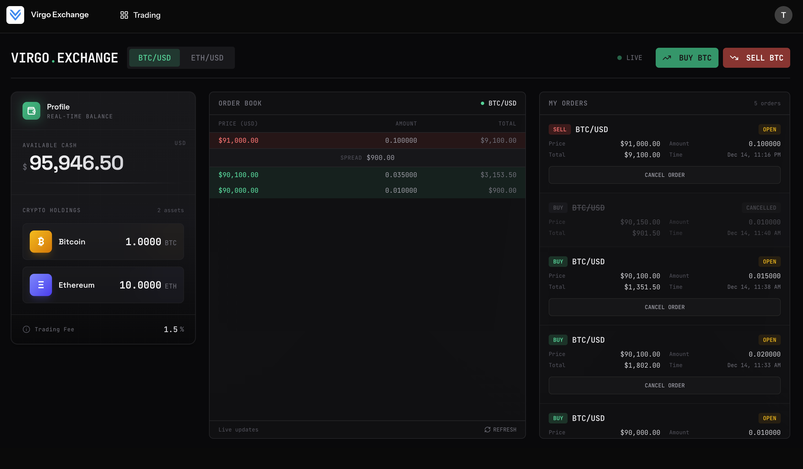

# Virgo Exchange

A cryptocurrency trading exchange test application built with Laravel 12, Inertia.js v2, Vue 3, and Tailwind CSS v4.



**Demo URL**: https://virgo-exchange-main-ehuoor.laravel.cloud/

## Requirements

- PHP 8.2+
- Node.js 18+
- Composer
- MySQL/PostgreSQL

## Installation

### Quick Setup

```bash
composer setup
```

This command will:
- Install PHP dependencies
- Create `.env` file from `.env.example`
- Generate application key
- Run database migrations
- Install npm dependencies
- Build frontend assets

### Manual Setup

1. Clone the repository and install dependencies:

```bash
composer install
npm install
```

2. Create environment file and generate app key:

```bash
cp .env.example .env
php artisan key:generate
```

3. Create the Mysql database and run migrations:

```bash
php artisan migrate
```

4. (Optional) Seed the database with sample trading data:

```bash
php artisan db:seed
```

5. Build frontend assets:

```bash
npm run build
```

## Development

Start all development servers (Laravel, queue worker, Pail logs, and Vite):

```bash
composer dev
```

This runs concurrently:
- Laravel development server
- Queue worker
- Laravel Pail (real-time logs)
- Vite dev server

### Individual Commands

```bash
# Start Laravel server only
php artisan serve

# Start Vite dev server only
npm run dev

# Process queue jobs
php artisan queue:work
```

## Testing

```bash
# Run all tests
php artisan test

# Run with coverage
php artisan test --coverage
```

## Code Quality

```bash
# Format PHP code
vendor/bin/pint

# Run static analysis
./vendor/bin/phpstan analyse

# Format frontend code
npm run format

# Lint frontend code
npm run lint
```

## Real-time Updates

The application uses Pusher for real-time orderbook updates. Configure your Pusher credentials in `.env`:

```
PUSHER_APP_ID=your_app_id
PUSHER_APP_KEY=your_app_key
PUSHER_APP_SECRET=your_app_secret
PUSHER_APP_CLUSTER=eu
VITE_PUSHER_APP_KEY="${PUSHER_APP_KEY}"
VITE_PUSHER_APP_CLUSTER="${PUSHER_APP_CLUSTER}"
```

## License

MIT
